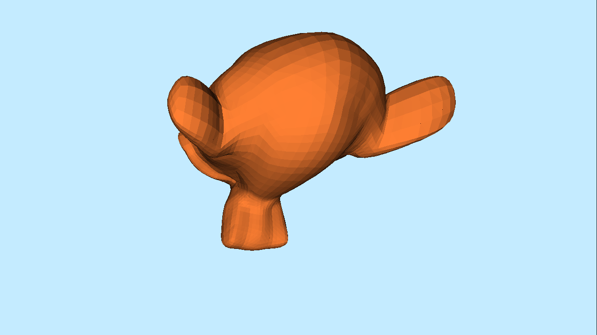
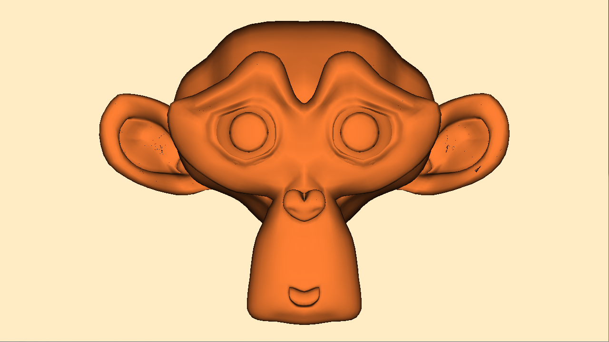
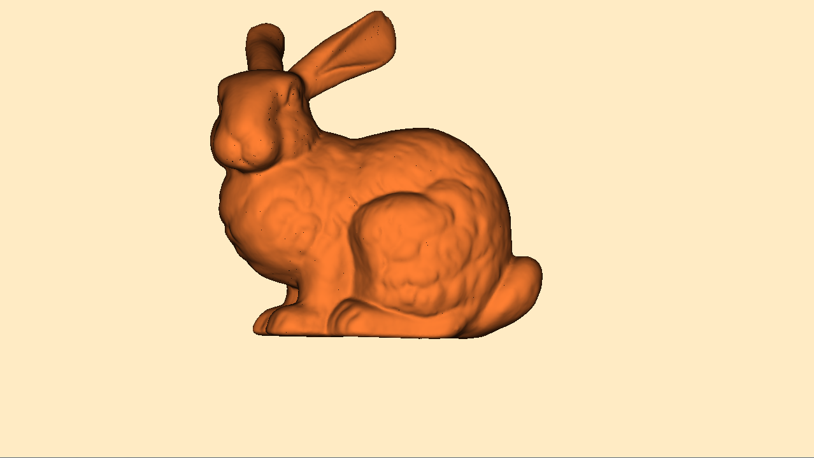

# gpu_raytracer
A learning project about GPU-powered raytracing: Vulkan, compute GLSL, BVH-accelerated raytracer, developed and tested on an Nvidia Kepler GPU(GTX 670))

Libraries and assets used:
- [stb_image and stb_image_write](https://github.com/nothings/stb) by Sean Barrett
- OBJ Parse by [Ryan Fleury](https://github.com/ryanfleury/)
- Blender Suzanne 3D model
- Stanford Bunny, from [Morgan McGuire's archive](https://casual-effects.com/data/)

Files of interest and what's going on in them:
- source.cpp: the main source file that initializes a win32 application and Vulkan instance, and launches the compute shaders
- minmax.comp: calculate the bounding box of the 3D model by finding a minimal and maximal x, y and z values
  of vertex coordinates of triangles(done via parallel reduction)
- centroidmorton.comp: given the ranges of each coordinate component of the model, we calculate 3D coordinates of polygon
  centroids within the ranges to calculate their Morton codes, and also their bounding boxes
- step1-7shader.comp: binary radix sorting of the Morton codes. First, we check the digit to see if it's 0 or 1. 
  Then we run a parallel scan over these flag values. Then, to obtain a scan that spans the entire range of our data, we
  calculate the sum of each scan, run parallel reduction on those, then modify the individual scans with the scan over sums.
  We have to do that since we're limited by the size of thread groups(basically processing chunks of 32 numbers).
  Given that, we can redistribute the values to sort for the current digit. After repeat for each binary digit 
  the codes will be sorted. That is important because the codes being adjacent to one another in the sorted array 
  means they are in close proximity in 3D space.
  Papers used for implementation: "Introduction to GPU Radix Sort" by Takahiro Harada and 
  "High performance and scalable radix sorting" by Duane Merrill and Andrew Grimshaw. I do not claim to have achieved performance
  comparable to the results of these papers :)
- tree_shader.comp: With the Morton codes sorted, we can build a binary radix tree. For each node of the tree, we determine the direction of the range
  by comparing the length of common prefix of the Morton codes, the one where the prefix is longer(which becomes the delta_node, the other delta_min), and then finding the other
  end of the range with binary search... ideally(I resorted to going over every element, as my implementation froze the drivers
  every time, and I never got around to fixing it). Then we find a split point, by binary searching(:^)) within our range, until we
  find an element with a longer common prefix than our node's. Then we record the current node and its two children, the elements
  around the split point.
- bvh.comp: Now we construct a BVH, by starting a thread at each element and "gathering up" the bounding boxes of each element into bigger boxes corresponding to each node of the tree.
  Using atomic counters, we record how many times each node's been visited, and terminate the first thread. That way each node is processed exactly once.
  Paper used for implementation of both shaders: "Maximizing Parallelism in the Construction of BVHs, Octrees, and k-d Trees" by Tero Karras
- raytrace.comp: finally, utilizing the outputs of all other shaders, we produce a raytraced image; running ray-box and ray-triangle queries.
  The way the tree is set up in my program is first n-1 nodes are leaves and last n nodes are triangles with children set to -1.

  First crack at tracing Suzanne:
  
  
  Smoother lighting after interpolating normals with barycentric coordinates, which we already used for ray-triangle query:
  
  
  The Bunny:
  